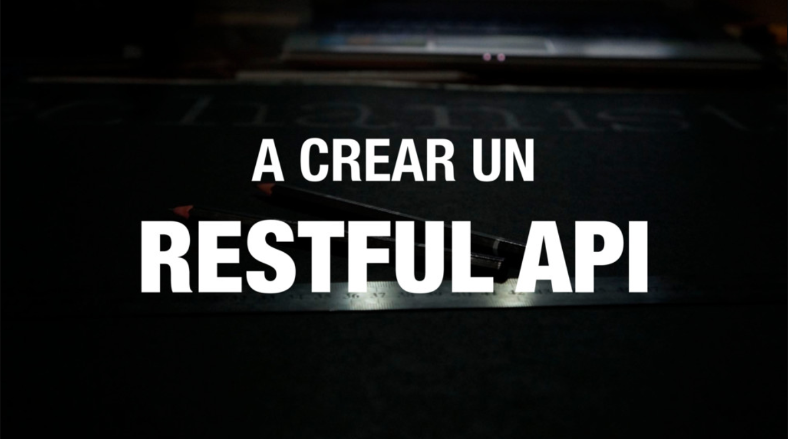
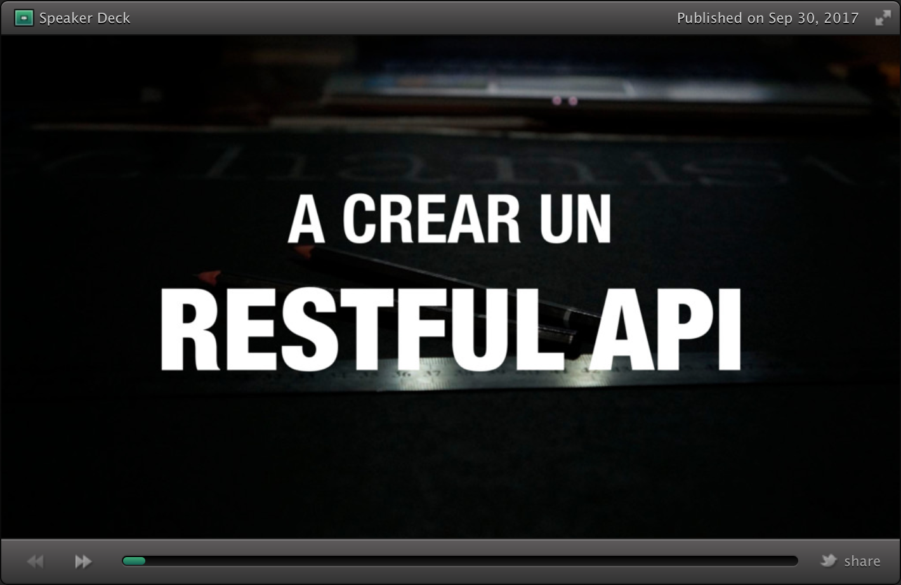

The **“A crear un RESTful API”** was a free crash course presented on September 30th, 2017 at [INTEC](https://www.intec.edu.do). This repo host the base project used by all participants to create their own RESTful API.

 - **Duration:** 3-4 hours.
 - **Language:** Spanish.
 - **Participants:** 35 people.

## ▶︎ Slides

With ❤️ by <a href="https://github.com/rmariuzzo">@rmariuzzo</a>

